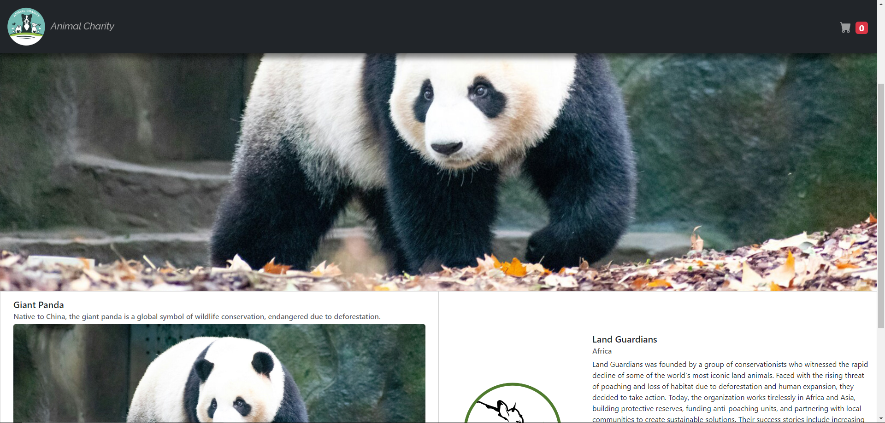

# Blazor-Microfrontend-PoC

## Description
This is a simple microfrontend project about different animal charities
options. A user can find out more information about multiple endangered 
species in the context of certain charities and but toys to aid the 
financial goal. The main purpose was to discover more about the Blazor
integration in the microfrontend architecture.

## The stack:
- Angular for host app and modal microfrontend
- Blazor WebAssembly for carousel microfrontend
- React for information area microfrontend
- Vue for basket page microfrontend
- Module federation for dynamic loading and sharing JS

### High level plan:

Red - Angular host
Blue - React informational page
Purple - Blazor carousel
Angular Micro - Angular modal
Vue Micro - Vue basket page

## Installation
1. Above the list of files, click <>Code.
2. Copy the desired URL for the repository (HTTPS, SSH), or use Github CLI.
3. Open Git Bash on your machine.
4. Change the current working directory to the location where you want the cloned directory:
    ```bash
        cd <workdir_name>
    ```
5. Type git clone, and then paste the URL you copied earlier:
    ```bash
        git clone <copied_URL>
    ```
6. Install the dependencies and run the host app:
    ```bash
        cd ./src/AngularHost/angular-host

        npm i --legacy-peer-deps

        ng serve
    ```
    This will run on https://localhost:4200/
7. Install the dependencies and run the angular micro:
    ```bash
        cd ./src/AngularMicro/angular-mfe

        npm i 

        ng serve
    ```
    This will run on https://localhost:4300/
8. Install the dependencies and run the react micro:
    ```bash
        cd ./src/ReactMicro/react-microfrontend

        npm i 

        npm run start-component
    ```
    This will run on https://localhost:3000/
9. Install the dependencies and run the vue micro:
    ```bash
        cd ./src/VueMicro/vue-mfe

        npm i 

        npm run start   
    ```
    This will run on https://localhost:8080/
10. Install the dependencies and run the blazor micro
    This will run on https://localhost:5200/
11. The main app will run on https://localhost:4200/

## Aditional Information
In order to make the Blazor component to run integrated, the following had to be done:
- install the NuGet packages Microsoft.AspNetCore.Components.CustomElements and Microsoft.AspNetCore.Components.Web, which is used for Blazor custom element configuration
- In `Program.cs`:
    ```csharp
        builder.RootComponents.RegisterCustomElement<AnimalsCarousel>("blazor-component");
    ```
- Leverage JS.Interop capabilities (thus sacrificng server side loading)
- Expose the state management method gloabally to be acessed by blazor component:
    ```html
        <body>
            <app-root></app-root>
            <script>
                function selectAnimalFromBlazor(animalId) {
                console.log('Blazor -> Passing animalId to Angular:', animalId);
                window.angularComponentRef.zone.run(() => {
                    window.angularComponentRef.selectAnimal(animalId);
                    const reactComponentSection = document.getElementById('react-component-section');
                    if (reactComponentSection) {
                    reactComponentSection.scrollIntoView({ behavior: 'smooth' });
                    }
                });
                }
            </script>
        </body>
    ```
- Import it with the right name:
    ```html
        <blazor-component></blazor-component>
    ```
- Give the required props and use CUSTOM_ELEMENTS_SCHEMA in the host component:
    ```js
        let blazorPayload: IBlazorComponentPayload | undefined;

        const blazorAnimals: IBlazorAnimal[] = this.dataService.animals.map(animal => ({
        id: animal.id,
        name: animal.name,
        imageUrl: animal.imageUrl
        }));

        const customCarouselCss = await cssFileToSingleLineString('../../assets/blazorCss/blazorCarousel.css');
        const customSlideCss = await cssFileToSingleLineString('../../assets/blazorCss/blazorCarouselSlider.css');

        blazorPayload = {
        animals: blazorAnimals,
        customCarouselCss: customCarouselCss || '', 
        customSlideCss: customSlideCss || '',
        };

        setBlazorPayloadParameters(blazorPayload);

        window.angularComponentRef = {
        zone: this.zone,
        selectAnimal: (animalId: string) => this.dataService.selectAnimal(animalId),
        };      
    ```

## Visuals

### Main Page


### Responsive View


### Modal Choice


### Basket Page


## Final Note
This project definetly need improvements and lacks high client complexity. On my list of such improvements,
I can put: refactoring the Blazor pages in smaller components, on the backend introducing the already 
started generic repository with specification pattern instead of using the EF context, better swagger 
documentation and more efficiency on nginx routing.

## License
This project is licensed under the MIT License. See the LICENSE file for details.

## Contact
Feel free to contact me at: karjhan1999@gmail.com